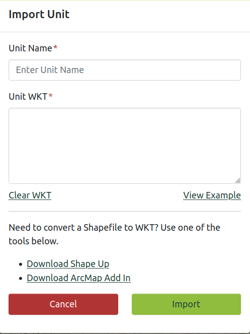

# Importing Units

:::tip
Importing units must be done in **WKT.**
:::

If you do not have your Unit in this file type click on either [“Download Shape Up”](https://ferns.odf.oregon.gov/E-Notification/downloads/fernshelpdoc.pdf#%5B%7B%22num%22%3A87%2C%22gen%22%3A0%7D%2C%7B%22name%22%3A%22XYZ%22%7D%2C33%2C125%2C0%5D) or [“Download ArcMap Add In”](https://ferns.odf.oregon.gov/E-Notification/downloads/fernshelpdoc.pdf#%5B%7B%22num%22%3A91%2C%22gen%22%3A0%7D%2C%7B%22name%22%3A%22XYZ%22%7D%2C33%2C474%2C0%5D).

---

