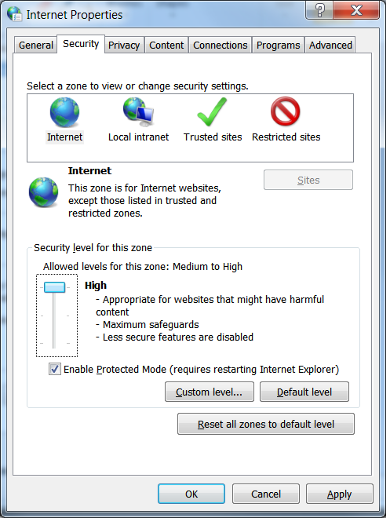

# Uploading Documents

:::tip
Documents must be in **.pdf** format. 
:::

For instructions on how to convert your document to PDF see the [Adobe Website](https://new.acrobat.com/en_us/products/pdf-pack.html?s_tnt=67837:1:0). 

When uploading documents you must ensure that you are uploading the document itself and not the document’s path.

---

## To do so (must be done in Internet Explorer):

1. While on the FERNS homepage click the gear icon in the upper right hand corner
   of your screen.

2. Click on Internet Options from the drop down menu that appears.

3. Click the Security Tab on the menu box that opens.

4. Click the “Custom level...” button

5. A selection menu will pop up. Scroll down and under “miscellaneous”, find
   “Include local directory path when uploading files to a server”, and select “Disable”.

6. Click the “OK” button. You will now be uploading the PDF itself rather than the
   path.

